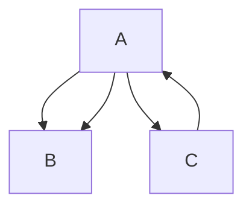

###### Callouts
>[!a]- Beispiele
>ajvhdaskzfgasfl

>[!info]+ Sinn oder Ziel, Formel, Definition

>[!todo] Handlung

>[!tip]- Sonderfälle

>[!question] Frage

>[!summary]- Ausführungen, Erklärungen

>[!done]- Gut

>[!warning] Wichtig

>[!error] Fehler

>[!fail] Problem

>[!bug] Systematisches Problem

>[!example] Aufzählungen

>[!quote] Zitat

###### Text
`# bis ######` unterschiedliche Überschriften

$L^AT_EX$

> Zitat
>>Zitat supreme

*italic*
**bold**
***bolditalic***
<font color=258798>RGB FARBE</font>
==Marker==
~~Durchstreichen~~
%% KOMMENTAR %%
`Inline code`

	code

```
code
```
###### Graphen

Graphen: https://github.com/mermaid-js/mermaid

<!-- Kommentar -->