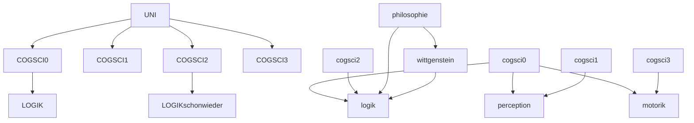

## Uni
- Scheiß auf Inhalt wissen
- Lernen zu lernen

---
## Structuring Thinking
- Verbindungen zwischen Ideen
- [[#ORDNER vs. netzwerk|Netzwerk statt linear]]
- Übersichtlichkeit
- Neue Verbindungen
- System verstehen statt Auswendig lernen

---
## Extended Mind
- Muss nicht alles im Kopf haben
- Wissen wie und wo ich es zuverlässig finden kann.
- Wiederreproduzierbarkeit: Verstehen und Üben

---
## Einheitlichkeit und Einfachheit
- Wissen wie es aufgebaut ist.
- Finden können was ich suche
- Nicht aufblähen
- Unterschiedliche Ebenen (aber **nicht Linear**)

---
## ORDNER vs. netzwerk
![[Pasted image 20221111110717.png]]
%%

%%

---
## Sachen wissen vs. Lernen können
Es geht nicht darum jetzt alles zu wissen. Es geht darum ein Gefühl zu entwickeln, was möglich ist, und zu lernen wie man es herausfindet.
**Mittel**:
- Andere Menschen
- Dieser Vault
- Google
- Discord
- Github
- Foren
- Blogs