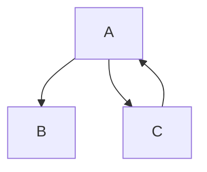

>[!a]- Beispiele

>[!info]+ Sinn oder Ziel

>[!todo] Handlung

>[!tip]- Sonderfälle

>[!question] Frage

>[!summary]- Ausführungen, Erklärungen

>[!done]- Formel, Definition

>[!warning] Wichtig

>[!error] Fehler

>[!fail] Problem

>[!bug] Systematisches Problem

>[!example] Aufzählungen

>[!quote] Zitat


> Zitat
>>Zitat supreme

<font color=258798>RGB FARBE</font>
==Marker==
~~Durchstreichen~~
%% KOMMENTAR %%

~~~
Kopierbar in weiss
~~~

``` CODE oder ERROR```

	code


Graphen: https://github.com/mermaid-js/mermaid

<!-- Kommentar -->